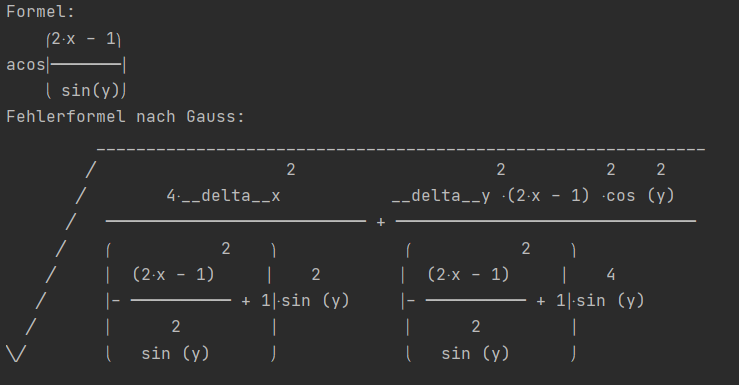
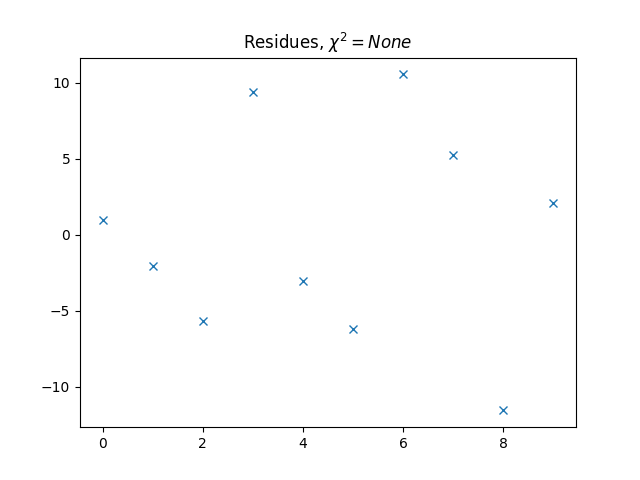
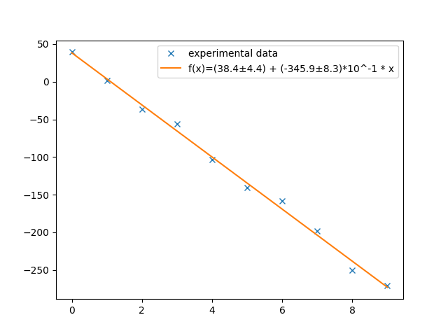
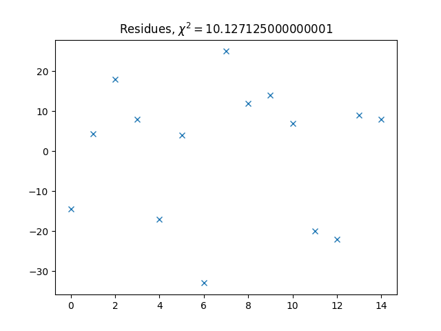
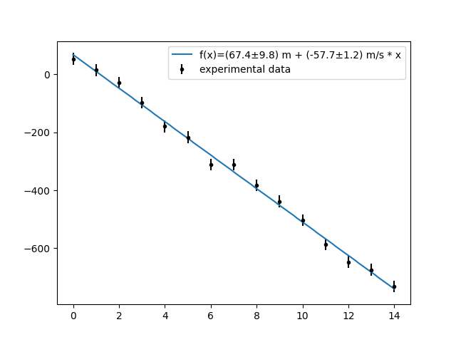
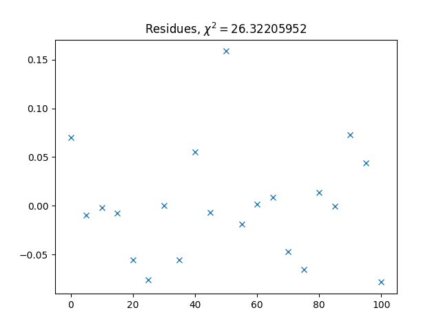
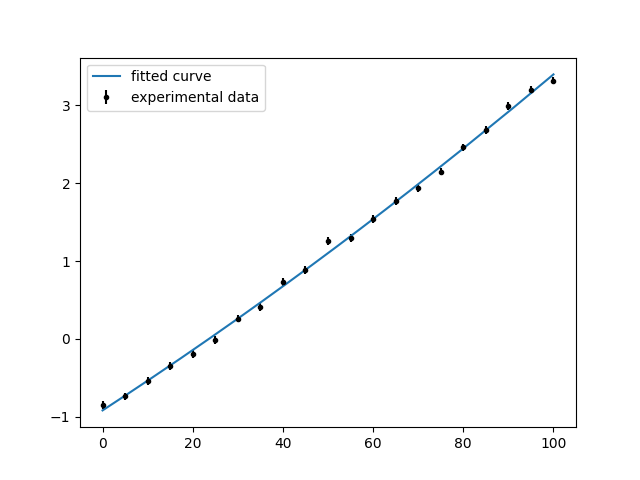
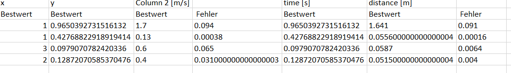

# Pyrror
Package for uncertainty analysis in Python.
It was developed while I was doing my Bachelor in physics.
The functionality is based on the lab courses.

## Warnings
The function exec is used within some functionalities.
This can cause harm if exploited.

## General introduction
The main classes of the package are `Data`, `Table` and `Formula`.
The package holds functionality for:

- Error/Uncertainty propagation in equations
- Create tables and calculate different types of averages including arithmetic, geometric, modus, ...
- Normal and simplified gauss propagation of uncertainties
- Regressions including covariant matrices as well as automated chi2 test and residuum plot
- Propagation of units within equations

The `Data`-class holds a mean value and an error.
Furthermore, can a `Data` carry a `Unit`.
The basic arithmetic methods including `*, /, +, -` are implemented.
Using these the error is propagated using simplified gauss.
For a normal propagation use a `Formula`.
For natural and other constants the `Const`-class can be used. 
A `Const` also carries a `Unit` but not an uncertainty.


## Documentation
### controls.py

---

#### instancemethod
Controls if an instance of a class is modified during a method.\
Raises an `AttributeError` if the instance is changed.\
**USAGE AS DECORATOR:**
```
class Dummy:

   @instancemethod
   def fuzz(self, a):
      return Dummy(...)
```

---

#### type_check
Controls for a given sequence of tuples if each variable has a specific type.\
Raises an `TypeError` if the type is incorrect.\
`type_check(*args) -> True`

**USAGE:**
```
>>> type_check((3, int), (1.2, float))
True
>>> type_check([("3", int)])
TypeError: Type of '<class 'str'>' is false! Try <class 'int'> instead
```

---

#### list_type_check
Controls if each element of a given list as a given type.\
`list_type_check(lst, data_type) -> bool`
- `lst`: `List[object]` = list of objects which should have the same type `data_type`
- `data_type`: `type` = specific type

Returns `True` if all `objects` in `lst` have the type `data_type` otherwise returns `False`.\
**USAGE:**
```
>>> list_type_check([2, 3, 1], int)
True
>>> list_type_check([2, "3", 1], int)
False
```

---
---

### unit.py

---

#### Unit-class
Represents a unit like 'm' for meter.\
``Unit(numerator="", denominator="")``
- `numerator` = `str` represents the upper units in a fraction
- `denominator` = `str` represents the lower units a fraction

For each `numerator` and `denominator` can a sequence of units be defined as specified by the following sign-EBNF:
```
S := '"' units '"'
units := unit | unit ';' units
unit := string | string '^' integer
```

**METHODS:**
-  `flip()`:\
    inverts the unit which means an exchange of numerator and denominator
      

**SPECIAL OPERATIONS:**

| types | + | - | *    | /    | \> | < | ==   | <= | >= |
|-------|---|---|------|------|----|---|------|----|----|
|`Unit` |   |   |`Unit`|`Unit`|    |   |`bool`|    |    |

**USAGE:**
```
>>> a = Unit("m", "s")
>>> a
m/s
>>> b = Unit("J;s", "m")
>>> b
(J*s)/m
>>> c = a * b
>>> c
J
```

---
---

### unit_helper.py
Assistance functionality for working with units.

---

#### unit_control
Controls if the given argument `other` carries the same unit as `self`.\
Raises an `TypeError` if `other` does not carry any unit.\
Raises an `ValueError` if `other` does not carry the same unit.

**USAGE AS DECORATOR:**
```
class Dummy:

   @unit_control
   def __add__(self, other):
      pass
```

---

#### has_unit
Returns if the given variable has a `unit` attribute.\
`has_unit(variable) -> bool`
- `variable` = object to check 

**USAGE:**
```
>>> has_unit(3)
False
```

---
---

### data.py
Provides the `Data`-class and the `Const`-class.

---

#### Data-class
Represents a real measurement with an uncertainty.\
`Data(value: str, error: str, sign: Union[str, Unit] = "", power: int = 0, n: int = 0)`
- `value` = string of the mean value
- `error` = string of the uncertainty
- `sign` = either string or `Unit`. Since only one string is given the usage differs a bit from the one in `Unit`. 
  The extended sign-EBNF reads:
  ```
  S := '"' units '"' | '"' units '/' units '"'
  units := unit | unit ';' units
  unit := string | string '^' integer
  ```
  The string will be split at '/' into `numerator` and `denominator`.
- `power` = additional factor to compensate pre-factors (eg. km -> 10^3 m -> power = 3). 
  It is advantageous to work with SI-units only and use `power` instead of kilo, milli, ...
- `n` = number of significant digits. Has to be greater than 0. If 0 (or not set seperatly), the number of digits
  will be determined from the length of `error`

**SPECIAL OPERATIONS:**

| types | +    | -    | *    | /    |  **  | \>   | <    | ==   | <=   | >=   |
|-------|------|------|------|------|------|------|------|------|------|------|
|`Data` |`Data`|`Data`|`Data`|`Data`|      |`bool`|`bool`|`bool`|`bool`|`bool`|
|`Const`|`Data`|`Data`|`Data`|`Data`|      |`bool`|`bool`|`bool`|`bool`|`bool`|
|`int`  |`Data`|`Data`|`Data`|`Data`|`Data`|`bool`|`bool`|`bool`|`bool`|`bool`|
|`float`|`Data`|`Data`|`Data`|`Data`|`Data`|`bool`|`bool`|`bool`|`bool`|`bool`|


**USAGE:**
```
>>> a = Data("123.456", "1.234", power=-2, sign="m/s")
>>> a
(123.456±1.234)*10^-2 m/s
>>> b = Data("4", "1.00000001", sign="s", n=2)
>>> b
(4.0±1.0) s
>>> c = a * b
>>> c
(4.9±1.2) m
```

---

#### Const-class
Represents a natural constant (through SI definition some may have no error, eg. the speed of light), or a measurement with neglected uncertainty.\
`Const(value: Union[int, float], sign: Union[str, Unit])`
- `value` = value of the constant
- `sign` = either string or `Unit`. Since only one string is given the usage differs a bit from the one in `Unit`. 
  The extended sign-EBNF reads:
  ```
  S := '"' units '"' | '"' units '/' units '"'
  units := unit | unit ';' units
  unit := string | string '^' integer
  ```
  The string will be split at '/' into `numerator` and `denominator`.

**SPECIAL OPERATIONS:**

| types | +     | -     | *     | /     |  **   | \>   | <    | ==   | <=   | >=   |
|-------|-------|-------|-------|-------|-------|------|------|------|------|------|
|`Data` |`Data` |`Data` |`Data` |`Data` |       |`bool`|`bool`|`bool`|`bool`|`bool`|
|`Const`|`Const`|`Const`|`Const`|`Const`|       |`bool`|`bool`|`bool`|`bool`|`bool`|
|`int`  |`float`|`float`|`Const`|`Const`|`Const`|`bool`|`bool`|`bool`|`bool`|`bool`|
|`float`|`float`|`float`|`Const`|`Const`|`Const`|`bool`|`bool`|`bool`|`bool`|`bool`|


The addition and subtraction with ints, floats is only possible if the `Const` has a `Unit` equal to `Unit()`

**USAGE:**
```
>>> a = Const(1, "m")
>>> a
1.0 m
>>> a + 1
ArithmeticError: Addition of values with different units is not possible
>>> b = Const(1, "")
>>> b
1.0
>>> b + 1
2.0
>>> type(b + 1)
<class 'float'>
```

---
---

### data_helper.py
Assistance functionality for working with Data.

---

#### digits
Returns the number of significant digits from a given error.\
`digits(error: Union[str, int, float]) -> int`
- `error` = the error the significant digits should be determined for

The result is the number of significant digits.\
**USAGE:**
```
>>> digits(1.23)
3
>>> digits("0.0012")
2
>>> digits(99.25)
4
```

---

#### round_data
Shortens the `value` and `error` of a `Data` to its length `Data.n`. Furthermore, it calculates which power should be used in the representation.\
`round_data(data: Data)`
- `data` = a instance of type `Data` to round values to correct length

Usage:\
It is used inside `Data` automatically. There should not be any need to use this.

---
---

### formula.py

---

#### Formula
Used for more complex functions and connections of uncertain data as well as a better
uncertainty analysis.\
`Formula(formula_string: str)`
- `formula_string` = `str` the given formula. This can be any valid `sympy` expression.


**METHODS:**
-  `latex(type_dict: Dict[str: type]) -> str`
    - `type_dict` = Dictionary specifying which type each variable in the `Formula` has\
    Returns a string of Latex-code of the given `Formula`
      

- `show_error(type_dict: Dict[str: type], unicode=False) -> str`
    - `type_dict` = Dictionary specifying which type each variable in the `Formula` has
    - `unicode` = Specifies if unicode should be used
    Returns a string of the formula and the propagation formula for the uncertainty
      

- `calc_unit(value_dict: Dict[Data, Const, float, int]) -> Unit`
    - `value_dict` = Dictionary assign a python object to each variable in the `Formula`\
    Returns a `Unit` for the result. If the `Unit` could not be determined shows a `warning`
      

- `calc(value_dict: Dict[Data, Const, float, int]) -> Unit`
    - `value_dict` = Dictionary assign a python object to each variable in the `Formula`\
    Returns the result of the calculation. If the `Unit` could not be determined shows a `warning`

**USAGE:**
```
>>> f = Formula("x**2 + exp(y)")
>>> f.latex({'x': Data, 'y': Data})
('x^{2} + e^{y}', '\sqrt{4 \left(__delta^{x}\right)^{2} x^{2} + \left(__delta^{y}\right)^{2} e^{2 y}}')
>>> a = Data("2.12", "0.05")
>>> b = Data("1.23", "0.02")
>>> f.calc({'x': a, 'y': b})
(79±2)*10^-1
>>> 
>>> f2 = Formula("x**2 + 2 * y")
>>> x = Data("1.3", "0.3", sign="m")
>>> y = Data("0.1", "0.22", sign="m^2")
>>> f2.calc({'x': x, 'y': y})
(19±9)*10^-1 m^2
>>>
>>> f = Formula("acos((2*x-1) / sin(y))")
>>> f
acos((2*x-1) / sin(y))
>>> f.show_error({"x": Data, "y": Data})           
```
Due to problems with markdown is a screenshot of the result given bellow:


---
---

### regression.py
Holds classes for different types of regressions. 
For implementing new Regressions an abstract base class `Regression` is given.

---

#### Regression(ABC)
Abstract base class for regressions. All regressions have to inherit from `Regression`.\
`Regression(tab: Table, data_dict: Dict[str, int], n_o_f_p: int)`
- `tab` = Table holding data for regression
- `data_dict` = Dictionary specifying what to use for the regression.
   The dictionary must specify columns for 'x' and 'y': `{'x': int, 'y' : int}`
- `n_o_f_p` = number of free parameters. Specifies the number of parameters which will be determined 
   within the regression

**ABSTRACT-METHODS:**
-  `__str__() -> str`
    - Gives a string representation of thr regression parameters.
   
- `calc(x) -> Union[float, int, Data, Const]`
  - calculates the theoretical expected value at `x` using the regression results
  
- `residues()`
  - creates a plot of the residues and shows it.

---

#### SimpleRegression(Regression)
Simple regression ignoring uncertainties of `x` and `y`.\
`SimpleRegression(table: Table, data_dict: Dict[str], n=2)`
- `tab` = Table holding data for regression
- `data_dict` = Dictionary specifying what to use for the regression.
   The dictionary must specify columns for 'x' and 'y': `{'x': int, 'y' : int}`
- `n` = number of significant digits for the parameters

The information of the regression include the `y-intercept` and `slope`.
They can be accessed through `__str__()`.

**USAGE:**
```
>>> b = (2 * random.random() - 1) * 100
>>> a = random.random() * 100
>>> b, a
(-35.60688387713966, 39.481128050640734)
>>> f = lambda x: b * x + a
>>> xs = list(range(10))
>>> ys = [f(x) + random.gauss(0, 10) for x in xs]
>>> tab = Table(column_names=["x", "y"])
>>> for x, y in zip(xs, ys):
        tab.add((x, y))
>>> r = SimpleRegression(tab, {"x": 0, "y": 1})
>>> r
Regression:
	y = a + b * x
	a: (38.4±4.4)
	b: (-345.9±8.3)*10^-1
>>> r.residues() # shown bellow
>>> r.plot() # shown bellow
```
| residues | plot |
|----------|------|
|| | 

---

#### GaussRegression(Regression)
Simple regression ignoring uncertainties of `x` and working with uncertainties of `y`.\
`GaussRegression(table: Table, data_dict: Dict[str], n=2)`
- `tab` = Table holding data for regression
- `data_dict` = Dictionary specifying what to use for the regression.
   The dictionary must specify columns for 'x' and 'y': `{'x': int, 'y' : int}`
- `n` = number of significant digits for the parameters

The information of the regression include the `y-intercept`, `slope`, `reduced chi2`, `chi2` and a `probability` for 
such a `chi2`.\
They can be accessed through `__str__()`.

**USAGE:**
```
>>> b = (2 * random.random() - 1) * 100
>>> a = random.random() * 100
>>> b, a
(-57.571015317118835, 60.44085386096929)
>>> f = lambda x: b * x + a
>>> xs = [Const(str(x), sign="s") for x in range(15)]
>>> ys = [Data(str(f(x.value) + random.gauss(0, 20)), "20", n=2, sign="m") for x in xs]
>>> tab = Table(column_names=["x", "y"], signs=["s", "m"])
>>> for x, y in zip(xs, ys):
        tab.add((x, y))
>>> r = GaussRegression(tab, {"x": 0, "y": 1})
>>> r
Regression:
	y = a + b * x
	a: (67.4±9.8) m
	b: (-57.7±1.2) m/s
	Chi2     : 10.127125000000001, Probability: 0.684, Chi2 red.: 0.7790096153846154
>>> r.residues() # shown bellow
>>> r.plot() # shown bellow
```
| residues | plot |
|----------|------|
|| | 

---

#### CovRegression(Regression)
**!!!Attention: Unfortunatly, does this class has a bug in calculating the error with the .calc()-Method!!!**\
Simple regression ignoring uncertainties of `x` and working with uncertainties of `y`.\
`CovRegression(formula_string: str, table: Table, data_dict: Dict[str, int], pars: List[str], n=2)`
- `formula_string` = A string specifying a formula which should be fitted.\
  The format of a formula is specified as given by the formula-EBNF. 
  ```
  S := 'y = ' exprs
  exprs := expr | expr '+' exprs | expr '-' exprs
  expr := para '*' func | para
  para := char ?has to be unique?
  func := ?mathematical function of x. Has to be a valid sympy expression?
  ```
  The `?` start and end EBNF-extensions.
  
- `table` = Table holding data for regression
  
- `data_dict` = Dictionary specifying what to use for the regression.
   The dictionary must specify columns for 'x' and 'y': `{'x': int, 'y' : int}`

- `pars` = List of the used parameters
  
- `n` = number of significant digits for the parameters

The information of the regression include the `parameters`, `reduced chi2`, `chi2` and a `probability` for 
such a `chi2`.\
They can be accessed through `__str__()`.

**USAGE:**
```
>>> data = [
        -0.849, -0.738, -0.537, -0.354, -0.196,
        -0.019, 0.262, 0.413, 0.734, 0.882,
        1.258, 1.305, 1.541, 1.768, 1.935,
        2.147, 2.456, 2.676, 2.994, 3.200,
        3.318]
>>> datas = [(Const(i, sign="°C"), Data(str(data[i // 5]), "0.05", sign="mV")) for i in range(0, 105, 5)]
>>> tab = Table(columns=2, column_names=["x", "y"], signs=["°C", "mV"])
>>> for data in datas:
        tab.add(data)
>>> r = CovRegression("y = a + b*x + c*x**2", tab, {"x": 0, "y": 1}, ["a", "b", "c"])
Regression:
	y =  a + b*x + c*x**2
	a: -0.919926595143981
	b: 0.0376650836577612
	c: 0.0000551933192665457
	Chi2     : 26.32205952, Probability: 0.093, Chi2 red.: 1.46233664

```
| residues | plot |
|----------|------|
|| | 

---
---

### chi_2.py

---

#### Chi2
Calculates the reduced `chi2_red`, the `chi2`, and the `probability` for a `Regression`.\
`Chi2(reg: Regression, chi2=True)`

- `reg` = Regression to calculate `chi2` and residues for
- `chi2` = specifies if `chi2` should be calculated or just the residues

**METHODS:**

- `show_residues()`
  - creates and shows a plot of the residues

  
**USAGE:**

This class is automatically used within a `Regression`.\
It should not be necessary to use it manually.

---
---


### table.py

---

#### Table
Class for storing many relevant data of different types. It can perform calculations columnwise and simplifies the 
handling of the calculations.\
`Table(column_names: List[str] = [], columns=2, signs: List[Union[str, Unit]] = [])`
- `column_names` = List of strings representing the names for the column
- `columns` = Number of columns for the table
- `signs` = List of units defined as given by the sign-EBNF:
```
    S := '"' units '"' | '"' units '/' units '"'
  units := unit | unit ';' units
  unit := string | string '^' integer
```

**METHODS:**
- `calc(formula: Formula, para_dict: Dict[str: Union[int, str, Any]], column_name="", sign=True)`\
  Uses the given formula on each row of the table to calculate a new column.
   - `formula` = Formula to use for calculation
   - `para_dict` = Dictionary specifying how the parameters are set.
      How the parameter will be treated depends on the type of the value.
        - `int`: The value will be used as column index, and the parameter will be set row-wise
        - `str`: The value will be used as value using `float(value)`
        - `Any`: All other types will be used as they are
    

- `add(data_tuple: Tuple[Any])`\
  Adds a new data-row to the `Table`. All columns have to be set. Use an empty string if you wish to fill it later.
   - `data_tuple` = Tuple of data to add in. 
    If a `Data` or `Const` is inserted it must have the same `Unit` as the column or `Unit()`


- `delete(line_index: int)`\
  Deletes a data-row in the `Table`. 
    - `line_index` = The line to delete.
   
    
- `drop(line_index: int) -> List[Any]`\
  Deletes a data-row in the `Table` and returns it. 
    - `line_index` = The line to delete.
    

- `add_column(name="")`\
  Adds a new column to the `Table`.  
    - `name` = Name of the new column. If not set the name will be 'Column \<i>' with i is the number of columns.


- `insert(line: int, column: int, value: Any)`\
  Inserts a value at `line`, `column`.  
    - `line` = The line the value has to be inserted
    - `column` = The column the value has to be inserted
    - `value` = The value to insert into the `Table`. If the value contains a `Unit` it will be replaced by the
    one corresponding to the column.
      

- `export(path: str, name: str, replace_dot=False)`\
  Exports the `Table` in '.csv'-format.  
    - `path` = path were the table should be saved
    - `name` = name of the file. Should end with '.csv'
    - `replace_dot` = Specifies if a '.' or a ',' is used to separate the decimals


- `max() -> List[Any]`\
  Returns the max of each column.\
  The type of each element in the list depend on the types in the column.


- `min() -> List[Any]`\
  Returns the min of each column.\
  The type of each element in the list depend on the types in the column.
  

- `arithmetic_average() -> List[Data]`\
  Returns the arithmetic average of all columns (mean + std).\
  The type of each element in the list depend on the types in the column.\
  If the type of the column is `Data` the average will be a weighted mean with its error.\
  Otherwise the uncertainty will be the sample standard deviation.


- `geometric_average() -> List[Union[Unit, float]]`\
  Returns the geometric average of all columns (mean only).\
  The type of each element depend on the `Unit` of the column an will either be a `float` or `Const`.


- `harmonic_average() -> List[Union[Unit, float]]`\
    Returns the harmonic average of all columns (mean only).\
    The type of each element depend on the `Unit` of the column an will either be a `float` or `Const`.


- `median() -> List[Union[Unit, float]]`\
    Returns the median of all columns (mean only).\
    The type of each element depend on the `Unit` of the column an will either be a `float` or `Const`.

- `modus() -> List[Union[Unit, float]]`\
    Returns the modus of all columns (mean only).\
    The type of each element depend on the `Unit` of the column an will either be a `float` or `Const`.

**USAGE:**

```
>>> data = tuple(zip([1, 1, 3, 2], [random.random() for i in range(4)]))
>>> tab = Table(column_names=["x", "y"], columns=2)
>>> for element in data:
        tab.add(element)
>>> tab
x    |y                      |
------------------------------
1    |0.9650392731516132     |
1    |0.42768822918919414    |
3    |0.0979070782420336     |
2    |0.12872070585370476    |
>>> tab.add_column(sign="m/s")
True
>>> tab
x    |y                      |Column 2 [m/s]    |
-------------------------------------------------
1    |0.9650392731516132     |                  |
1    |0.42768822918919414    |                  |
3    |0.0979070782420336     |                  |
2    |0.12872070585370476    |                  |
>>> data = [Data(str(random.randint(1, 20)), str(random.random()), n=2) for i in range(4)]
>>> for index, data_ in enumerate(data):
        tab.insert(index, 2, data_)
>>> tab
x    |y                      |Column 2 [m/s]        |
-----------------------------------------------------
1    |0.9650392731516132     |(170.0±9.4)*10^-2     |
1    |0.42768822918919414    |(1300.0±3.8)*10^-4    |
3    |0.0979070782420336     |(60.0±6.5)*10^-2      |
2    |0.12872070585370476    |(40.0±3.1)*10^-2      |
>>> f = Formula("a * c")
>>> tab.calc(f, {"a": 1, "c": Const(1, "s")}, "time")
>>> tab
x    |y                      |Column 2 [m/s]        |time [s]               |
-----------------------------------------------------------------------------
1    |0.9650392731516132     |(170.0±9.4)*10^-2     |0.9650392731516132     |
1    |0.42768822918919414    |(1300.0±3.8)*10^-4    |0.42768822918919414    |
3    |0.0979070782420336     |(60.0±6.5)*10^-2      |0.0979070782420336     |
2    |0.12872070585370476    |(40.0±3.1)*10^-2      |0.12872070585370476    |
>>> tab.calc(f, {"a": 2, "c": 3}, "distance")
>>> tab
x    |y                      |Column 2 [m/s]        |time [s]               |distance [m]         |
---------------------------------------------------------------------------------------------------
1    |0.9650392731516132     |(170.0±9.4)*10^-2     |0.9650392731516132     |(164.1±9.1)*10^-2    |
1    |0.42768822918919414    |(1300.0±3.8)*10^-4    |0.42768822918919414    |(556.0±1.6)*10^-4    |
3    |0.0979070782420336     |(60.0±6.5)*10^-2      |0.0979070782420336     |(58.7±6.4)*10^-3     |
2    |0.12872070585370476    |(40.0±3.1)*10^-2      |0.12872070585370476    |(51.5±4.0)*10^-3     |
>>> tab.arithmetic_average()
[(17.5±4.8)*10^-1, (4.0±2.0)*10^-1, (1300.8±3.8)*10^-4 m/s, (4.0±2.0)*10^-1 s, (556.0±1.6)*10^-4 m]
>>> tab.export(<path>, "dummy.csv") # <path> needs to be a real path
```
The last order produces a file called 'dummy.csv'. This file is given bellow:


---
---

## TODO:

- make to python package
- Tests for chi_2
- Tests for regression
- Improve all Tests (they no longer test all functionalities)
- Data should format in such a way, that the mean value is given by 1,...
not the error
  
- Add confindece band to plots
- Add automatic x/y label to plot (for SimpleRegression already done)

## FIXME:
- Covariant Matrix has problem with error (comparison with presentaion result shows a missing 2* in the total error)
